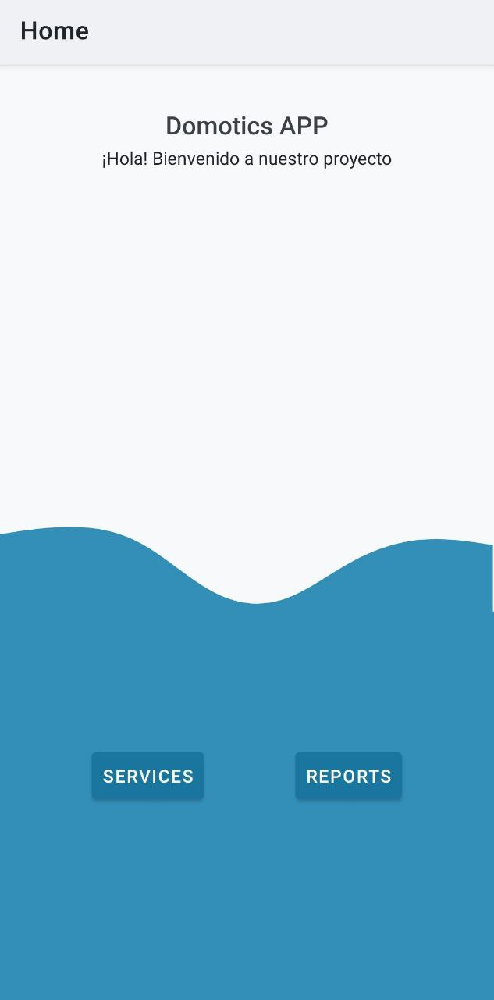
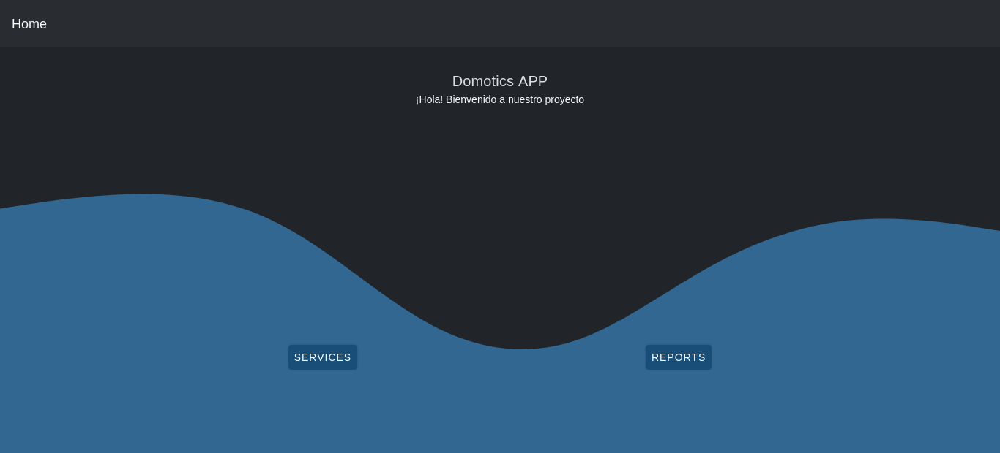

# Domotics APPs

_Lee esto en otros lenguajes: [English](README.md), [Español](README.es.md)_.

## ¿Cuál es la razón?

A lo largo de la pandemia se realizaron distintos cambios a los espacios educativos para adaptarlos a un modelo mixto. Estos cambios significaron tener que adaptarnos de manera apresurada y se han evidenciado problemas al respecto.

## ¿Cuál es el objetivo?

Como objetivo principal nos planteamos el optimizar los recursos en un salón de clase, facilitando el acceso a los diferentes dispositivos presentes en este mediante el control remoto.

## ¿Cómo lograrlo?

Definimos los requerimientos de usuario frente a las necesidades que puede llegar a tener dentro del espacio, como el control y distintos accesos a elementos del aula para conseguir un aprendizaje cómodo y agradable.

## Capturas de pantalla

### Celular

### Aplicación web

