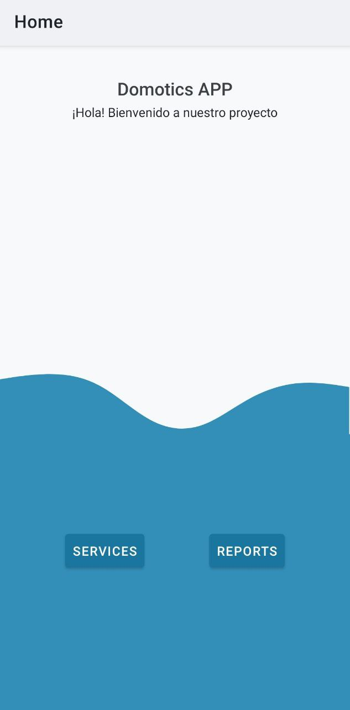
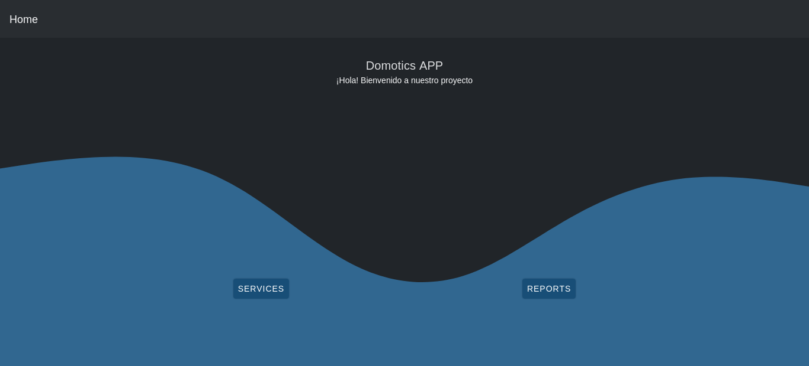

# Domotics APPs

_Read this in other languages: [English](README.md), [Español](README.es.md)_.

## What is the reason?

Throughout the pandemic, various changes were made to educational spaces to adapt them to a blended model. These changes meant that we had to adapt in a hasty manner and problems have been evidenced in this regard.

## What is the goal?

Our main objective was to optimize the resources in a classroom, facilitating access to the different devices present in the classroom through remote control.

## How archieve it?

We define the user requirements regarding the needs that they may have within the space, such as control and different accesses to elements of the classroom to achieve a comfortable and pleasant learning.

## Screenshots

### Mobile

### Web app

